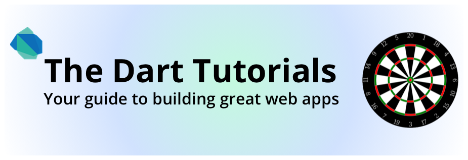
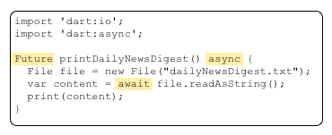
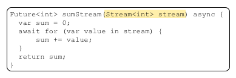

**The Dart Tutorials** teach you how to build web applications
using the Dart language, tools, and APIs.

<strong>Who are you?</strong>
<ul>
<li> You already know how to program in a structured language like C or Java.</li>
<li> You are familiar with object-oriented programming.</li>
<li> You might not know how to program the browser
     through the DOM (Document Object Model).</li>
</ul>

<strong>Let's go!</strong> Follow the tutorials in order
from left to right...or choose just the ones you need.

  <ul class="nav nav-tabs">
    <li class="active"><a href="#basics" data-toggle="tab">Get started</a></li>
    <li><a href="#packages" data-toggle="tab">Packages</a></li>
    <li><a href="#futures" data-toggle="tab">Async</a></li>
  </ul>

  

  <!-- BASICS TAB -->
    

      

        Download the software and
        discover which tools and libraries you get with the bundle.
        Run two sample apps.
      

      

        <!-- Get Started -->
        

          <section>
          <h4 class="no-permalink"><a href="get-started/">&nbsp;Get started</a></h4>
            
Get Dart. Run two apps.
            

          
          </section>
        

      
 <!-- end row -->
    
 <!-- end Get Started tab -->

  <!-- PACKAGES TAB -->
    

      

        Dart developers have been busy creating code libraries that can help you be more productive.
        Leverage that code or put your code out in the world to share with others.
      

      

        <!-- Packages -->
        

          <section>
          <h4 class="no-permalink"><a href="shared-pkgs/">&nbsp;Install Shared Packages</a></h4>
          
Organize and share code at <a href="https://pub.dartlang.org/">pub.dartlang.org</a>.

          
          </section>
        

        

        

      

    
 <!-- end Packages tab -->

  <!-- FUTURES & STREAMS TAB -->
    

      

        The Future and Stream classes provide API for performing tasks,
        such as input/output, asynchronously, so as to avoid blocking your
        program.
        Futures and Streams are fundamental to most Dart programs.
      

      

        

          <section>
          <h4 class="no-permalink"><a href="futures/">&nbsp;Asynchronous Programming: Futures</a></h4>
          
A first look at using Futures for asynchronous tasks.

          
          </section>
        

          <section>
          <h4 class="no-permalink"><a href="streams/">&nbsp;Asynchronous Programming: Streams</a></h4>
          
Use streams to manage sequences of data.

          
          </section>
        

        

      

    

    <!-- COMMAND-LINE APPS TAB -->
    

      

        Dart isn't just for browser-based applications.
        You can write standalone programs, such as servers and scripts, in Dart.
      

    

  
 <!-- end tab content-->

 <!--end tabbable -->

 <!-- end of tute-tabs -->
