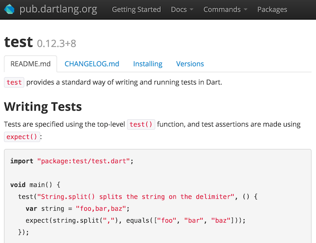

# {{ page.title }}

## <a href="shared-pkgs">&nbsp;Install Shared Packages</a>

Dart developers have been busy creating code libraries that can help you
be more productive.
Leverage that code or put your code out in the world to share with others.
Organize and share code at
<a href="https://pub.dartlang.org/">pub.dartlang.org</a>.

