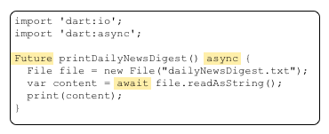

# {{ page.title }}

The Future and Stream classes provide API for performing tasks,
such as input/output, asynchronously, so as to avoid blocking your
program.
Futures and Streams are fundamental to most Dart programs.

## <a href="futures">&nbsp;Asynchronous Programming: Futures</a>

A first look at using Futures for asynchronous tasks.

## <a href="streams">&nbsp;Asynchronous Programming: Streams</a>

Use streams to manage sequences of data.

